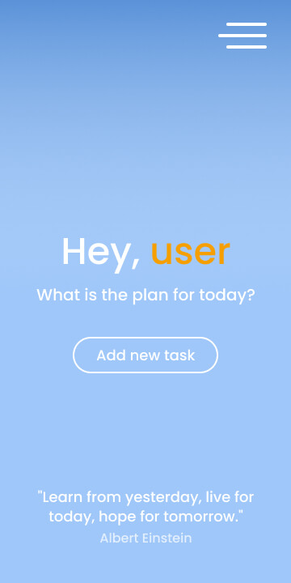

# Figma app design

Mobile and desktop layouts for my [Organizzzer App](https://github.com/bartekszajna/organizer_app) created with the use of [Figma](https://figma.com), free design&prototyping tool. Both versions exclusively built by me.

Along the process I was taking advantage of [Color Wheel from Adobe](https://color.adobe.com/create/color-wheel) to choose colors and select reasonably consistent palette (included as a separate frame/page in figma file).

Images come from [Unsplash](https://unsplash.com) (Credits down below).

## Mobile version

  
  
  

  
  
  

  
  

## Desktop version

  
  
  

  
  
  

  

## Credits:

Photo by <a href="https://unsplash.com/@vadimpng?utm_source=unsplash&amp;utm_medium=referral&amp;utm_content=creditCopyText">Vadim Fomenok</a> on <a href="https://unsplash.com/?utm_source=unsplash&amp;utm_medium=referral&amp;utm_content=creditCopyText">Unsplash</a>

Photo by <a href="https://unsplash.com/@alexisrbrown?utm_source=unsplash&amp;utm_medium=referral&amp;utm_content=creditCopyText">Alexis Brown</a> on <a href="https://unsplash.com/s/photos/studying-people?utm_source=unsplash&amp;utm_medium=referral&amp;utm_content=creditCopyText">Unsplash</a>
